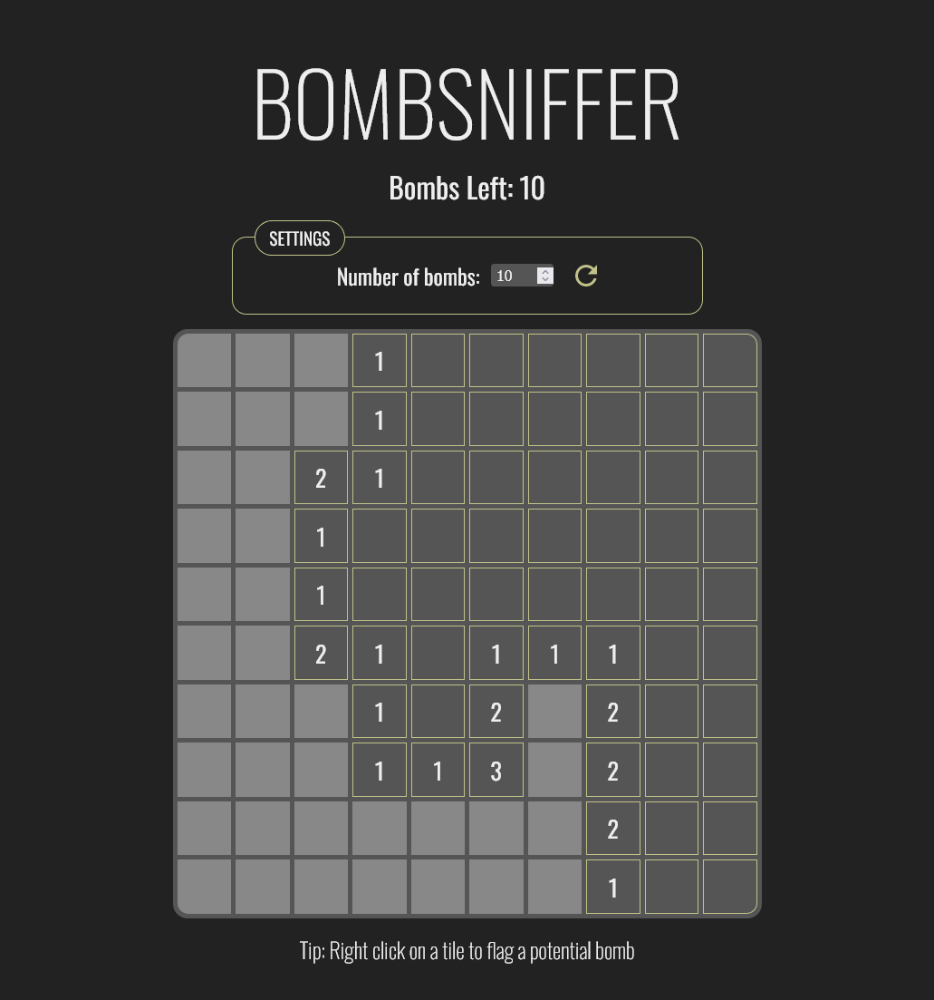
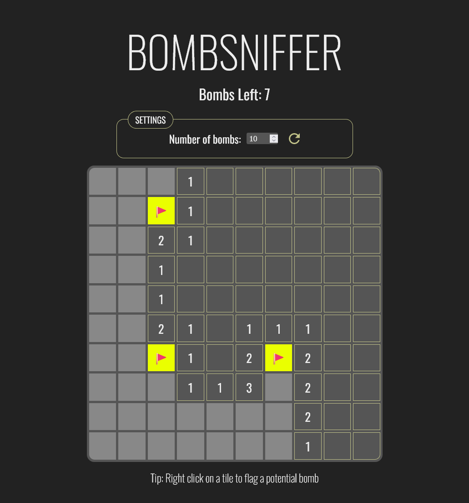
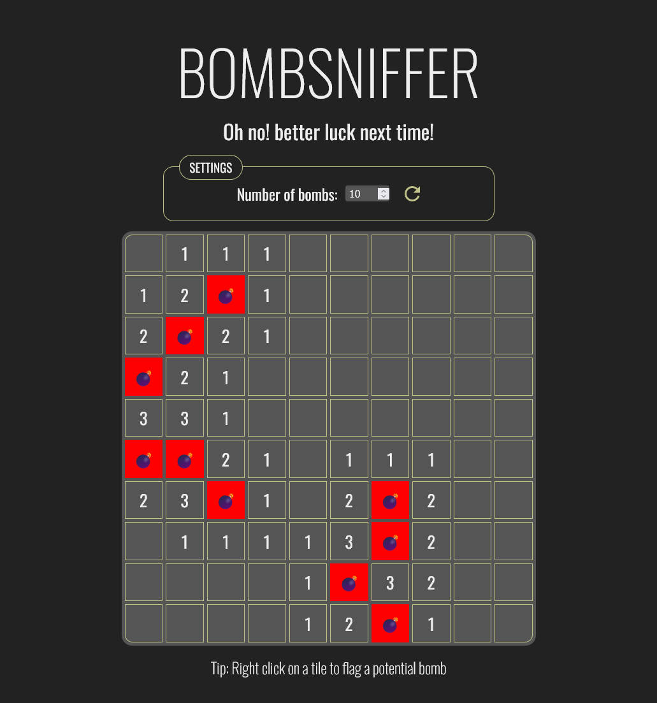
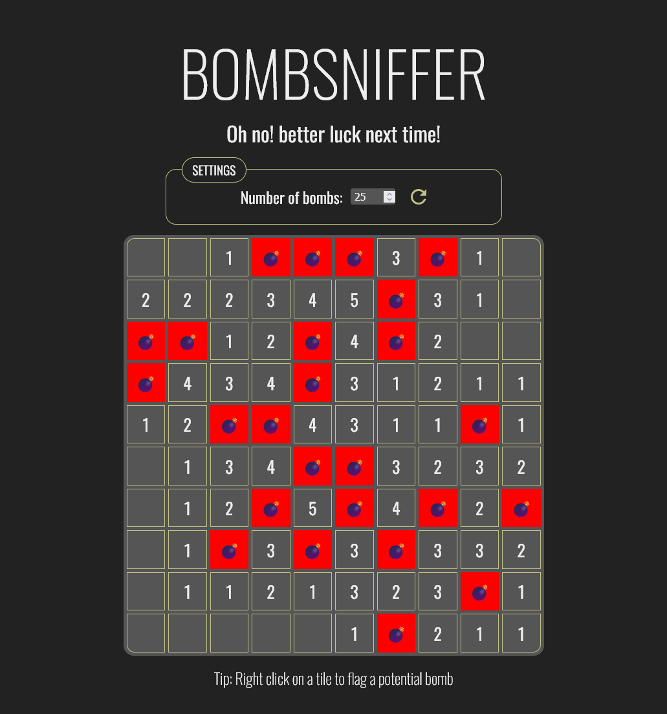

# Bombsniffer

Developed by TJ Klimoski.

[Live demo](https://bombsniffer.vercel.app/)  
[Github](https://github.com/Tjklimoski/bombsniffer)

## About Bombsniffer

Minesweeper clone with customizable bomb density to adjust diffculty.

## Technologies

Nested Comments was built with:

- React
- Javascript
- HTML
- CSS

## How to Run Locally

Clone repo:

    git clone https://github.com/Tjklimoski/bombsniffer.git

Install dependecies:

    npm i

Then, to run locally:

    npm run dev

Application available at http://localhost:3000/
